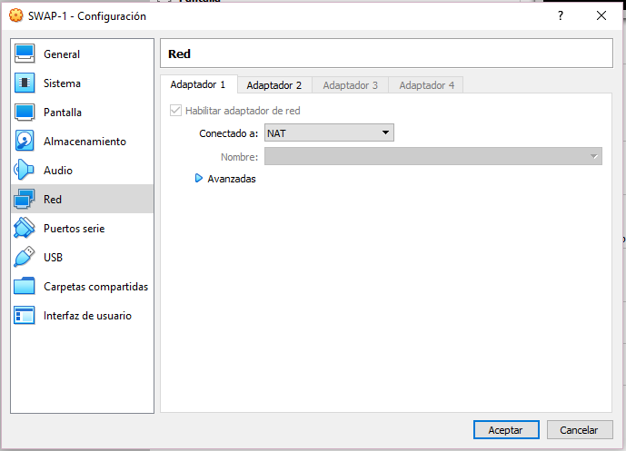
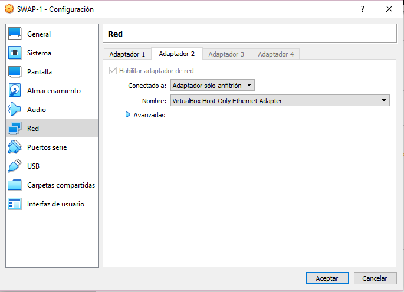
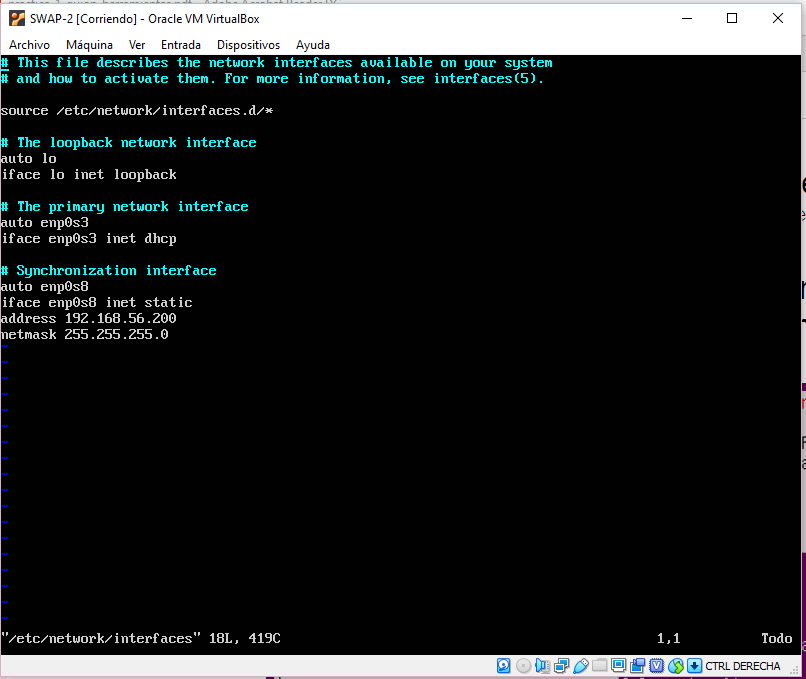

## Practica 1
### Presentacion de las herramientas - por Paula Ruiz

### Instalacion y configuracion.
Empezamos creando las dos maquinas virtuales con Ubuntu Server 16.04, a las cuales les instalamos OpenSSH server y LAMP server desde el principio dentro de la inicialización del programa.

A continuacion configuramos las redes dentro de la configuracion de VirtualBox para que ambos servidores tengan la conexion entre ellos y la maquina principal que esta en windows. (*duda al profesor*).

Ademas, preparamos los servidores para que puedan tener comunicacion entre ellos y el host. Para ello les añadimos los IPs correspondientes mediante la interfaz de sincronizacion enp0s8 (ya que por defecto no estan definidos) todo esto en el archivo /var/network/interfaces, 192.168.56.100 (Maquina 1) y 192.168.56.200 (Maquina 2).

Activamos el enp0s8 mediante el comando `ifup enp0s8`. Y la configuracion de ambas maquinas quedaria tal que asi:

Probamos haciendo ping entre ambas maquinas tienen conexion entre ellas:

`ping 192.168.56.100`

`ping 192.168.56.200`

**A partir de aqui solo mostrare las capturas de pantalla de una unica maquina, ya que hago paralelamente lo mismo en ambas.**

### Funcionamiento LAMP
Para comprobar el funcionamiento de LAMP probamos que cual es la version que usamos de apache y si esta funcinando.

Tambien comprobamos la version de php y si esta en funcionamiento.

Y por ultimo, probamos si podemos meternos en MySQL como base de datos del servidor.

### Funcionamiento SSH
Para comprobar el funcionamiento de ssh hemos usado la orden `shh ipmaquina -l usuario` entre ambas maquinas.

Prueba de la 1 a la 2:

Prueba de la 2 a la 1:

### Funcionamiento cURL
Para la comprobacion de cUrl creamos un documento HTML.

Y comprobamos mediante cUrl que tenemos acceso al mismo mediante la maquina 2 a la maquina 1.

Y comprobamos mediante cUrl que tenemos acceso al mismo mediante la maquina 1 a la maquina 2.

Y tambien comprobamos desde el nuestro navegador (HOST) que podemos acceder al mismo archivo.

