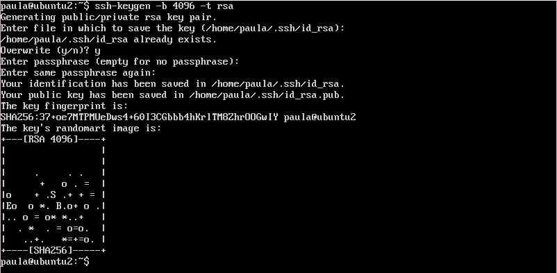

## Practica 2
### Clonar la informacion de un sitio web - por Paula Ruiz

### Funcionamiento de la copia de archivos por ssh.
Esta funcion sirve para crear un archivo tar.tgz de un equipo y dejarlo directamente en el equipo destino si no disponemos espacio en nuestro disco local.

En esta ocasion vamos a crear una carpeta en nuestra maquina 1, con diferentes tipos de archivos.

Y ahora vamos a aplicar a la carpeta creada la compresion al archivo tar.tgz en nuestra maquina 2.

`tar czf - copia_Archivos | ssh 192.168.56.200 'cat > ~/tar.tgz'`

Y ahora comprobamos que el archivo comprimido se encuentra en nuestra maquina 2.

### Clonado de una carpeta entre dos maquinas (con rsync).

_A partir de aqui todo lo que ejecutemos sera en la maquina 2._

Para ello lo primero que necesitamos es instalar rsync mediante `sudo apt-get install rsync`

Para probar que funciona vamos a sincronizar las carpetas `/var/www/` de ambas maquinas. Primero crearemos un documento __prueba_rsync.html__ en la maquina 1 para saber si se ejecuta con exito nuestra sincronizacion.

Luego sincronizaremos nuestras maquinas mediante la ejecucion:

`rsync -avz -e ssh 192.168.56.100:/var/www/ /var/www/`

Nos pide la clave de usuario, y tras unos momentos podemos comprobar que el directorio ha sido clonado con exito. Para ello revisamos que en la maquina 2 se encuentre el fichero que creamos anteriormente en la maquina 1.

### Configuración de ssh para acceder sin que solicite contraseña.

Ahora buscamos acceder a la maquina 1 desde la maquina 2 a traves del servicio ssh sin que pidan contraseñas. Para ello vamos a usar una autentificacion con un par de claves publicas y privadas, que podemos obtener mediante la funcion `ssh-keygen` de la siguiente manera:

`ssh-keygen -b 1096 -t rsa`

Dejamos en blanco el hueco que nos pide un lugar donde guardar la clave _Enter file in which to save the key:_ para que se cree por defecto en el directorio __~/.ssh__. Ademas, para el caso de querer conectar equipos sin necesidad de contraseña, tambien tenemos que dejar en blanco el hueco de _passphrase_.

Para copiar la clave de la maquina 2 a la maquina 1 usamos el comando `ssh-copy-id` a continuacion de la id de la maquina destino.

`ssh-copy-id 192.168.56.100`

Ahora nuestra clave se encuentra en el archivo __~/.ssh/authorized_keys__ de la maquina 1. Si por casualidad se perdiera la clave, volveria pedirnos la contraseña.

Podemos comprobar que ahora haciendo `ssh`, desde nuestra maquina 1 a nuestra maquina 2, no se nos pide ninguna contraseña.

