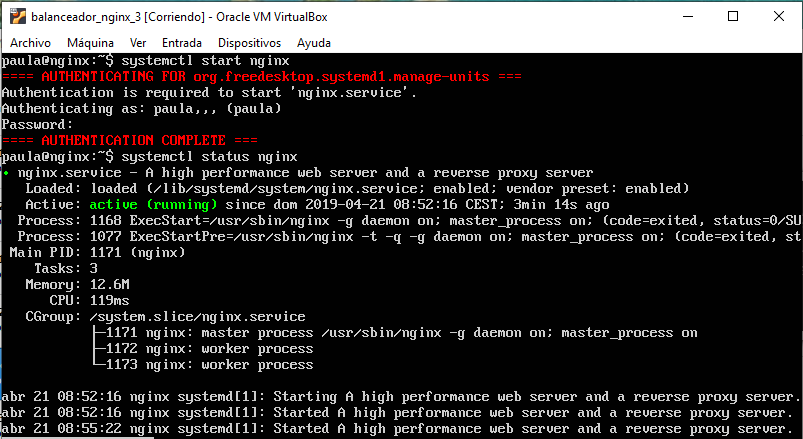
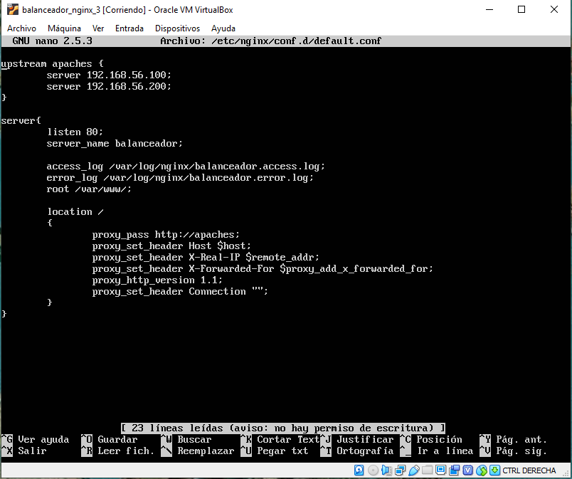
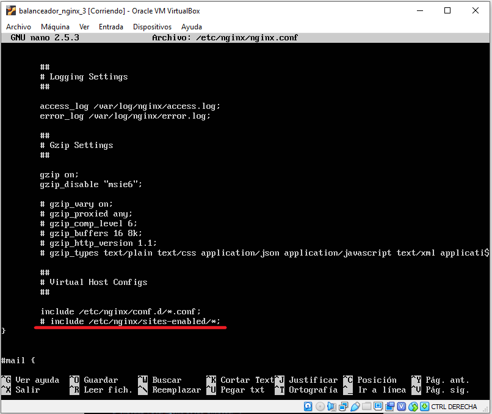

## Practica 3
### Balanceo de carga - por Paula Ruiz

Para empezar a configurar los balanceadores de carga, lo primero que he hecho ha sido ha sido crear dos maquinas virtuales, sin ningun tipo de paquete preinstalado (ya que no se debe ocupar el puerto 80).

Ha ambas maquinas les he asignado la IP 192.168.56.105.

### _nginx_ como balanceador de carga.
En este caso nuestra maquina virtual se llama __balanceador_nginx_3__. Lo primero que hemos hecho ha sido configurar la maquina para que se vea con las demas.

A continuacion, una vez que todas nuestras maquinas pueden verse, vamos a configurar el servicio de balanceo. Lo primero de todo instalar nginx:

`sudo apt-get install nginx`

Y comprobamos que todo funciona bien de primeras:

`systemctl start nginx`

`systemctl status nginx`

Ahora empezamos a configurar el balanceador, de manera que nos dirigiremos hacia el archivo _/etc/nginx/conf.d/default.conf_. Y lo configuraremos de tal forma que balancee los servidores de nuestras maquinas 1 y 2.

`nano /etc/nginx/conf.d/default.conf`

Por ultimo, modificamos el archivo _/etc/nginx/nginx.conf_ para que solamente actue como balanceador. Para ello comentamos la siguiente linea:

Y ya estaria nuestro balanceador configurado, solo quedaria probarlo en nuestra 4º maquina (en mi caso la 3º de las normales), mediante al siguiente orden:

`curl 192.168.56.105`

### _haproxy_ como balanceador de carga.

### someter a la granja web a una alta carga, generada con la herramienta Apache Benchmark.
