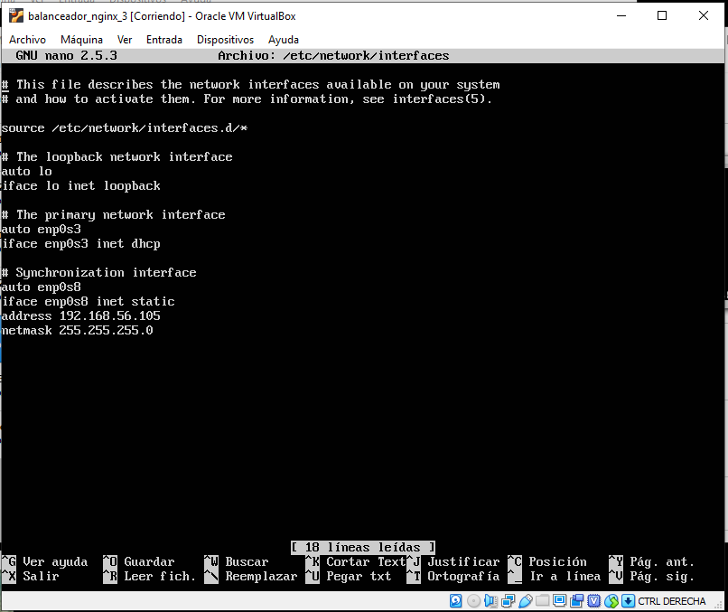
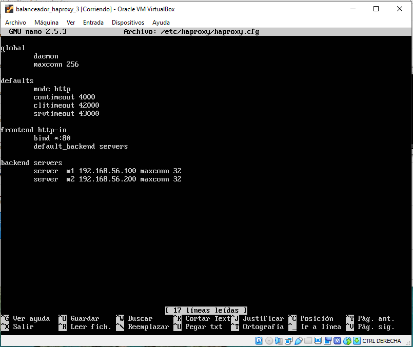
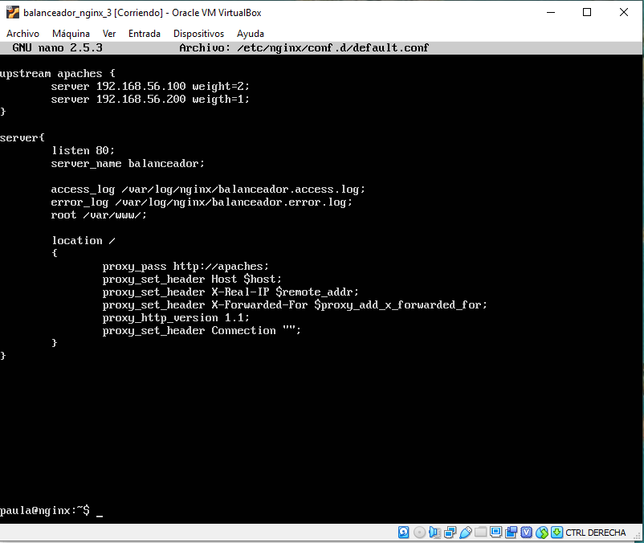
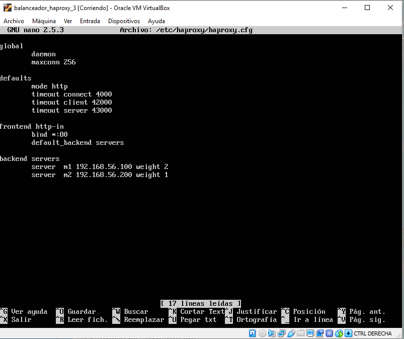

## Practica 3
### Balanceo de carga - por Paula Ruiz

Para empezar a configurar los balanceadores de carga, lo primero que he hecho ha sido ha sido crear dos máquinas virtuales, sin ningún tipo de paquete preinstalado (ya que no se debe ocupar el puerto 80).

Ha ambas máquinas les he asignado la IP 192.168.56.105.

### _nginx_ como balanceador de carga.
En este caso nuestra máquina virtual se llama __balanceador_nginx_3__. Lo primero que hemos hecho ha sido configurar la máquina para que se vea con las demás.

A continuación, una vez que todas nuestras máquinas pueden verse, vamos a configurar el servicio de balanceo. Lo primero de todo instalar nginx:

`sudo apt-get install nginx`

Y comprobamos que todo funciona bien de primeras:

`systemctl start nginx`

`systemctl status nginx`

Ahora empezamos a configurar el balanceador, de manera que nos dirigiremos hacia el archivo _/etc/nginx/conf.d/default.conf_. Y lo configuraremos de tal forma que balancee los servidores de nuestras máquinas 1 y 2.

`nano /etc/nginx/conf.d/default.conf`

Por último, modificamos el archivo _/etc/nginx/nginx.conf_ para que solamente actúe como balanceador. Para ello comentamos la siguiente línea:

Y ya estaría nuestro balanceador configurado, solo quedaría probarlo en nuestra 4º máquina (en mi caso la 3º de las normales), mediante al siguiente orden:

`curl 192.168.56.105`

### _haproxy_ como balanceador de carga.

Igual que en el caso anterior, ahora vamos a configurar el balanceador de carga creado en la máquina virtual __balanceador_haproxy_3__.

Ahora, instalamos el servicio de haproxy, igual que en nginx:

`sudo apt-get install haproxy`

Una vez instalado, nos vamos a la configuración de haproxy, situada en el archivo _/etc/haproxy/haproxy.cfg_. El cual nos debe quedar de la siguiente forma:

`nano /etc/haproxy/haproxy.cfg`

Una vez configurado todo, decidimos lanzar el servicio mediante la siguiente orden:

`sudo /usr/sbin/haproxy -f /etc/haproxy/haproxy.cfg`

Pero, como podemos comprobar, nos dice que tenemos una serie de errores, los cuales tratan de que estamos usando directivas obsoletas.

Por lo que solucionamos los errores, y nos quedarían la siguiente configuración:

Y vemos que ya no nos sale ningún error al lanzar el servicio.

Por lo que ya solo nos queda comprobar que todo funciona correctamente en nuestra 4º máquina.

`curl 192.168.56.105`

### Someter a la granja web a una alta carga, generada con la herramienta Apache Benchmark.

En este apartado sobrecargaremos el servidor balanceado para ver cuál es mejor.

Para ello usaremos el comando mostrado a continuación, el cual envía 1000 peticiones al servidor, concurrentemente de 10 en 10.

`ab -n 1000 -c 10 http://192.168.56.105/index.html`

#### nginx con Round-Robin

Con la configuración Round-Robin, que tenemos ya implementada nos da los siguientes resultados.

Y en la máquina 3 nos muestra el resultado del testeo de la carga:

#### nginx con Ponderación

Ahora modificamos la configuración para hacerla mediante ponderaciones. En nuestro caso diremos que la máquina 1 recibirá el doble de carga que la máquina 2.

Los resultados son:

Y en la máquina 3 nos muestra el resultado del testeo de la carga:

#### haproxy con Round-Robin

Con la configuración Round-Robin, que tenemos ya implementada nos da los siguientes resultados.

Y en la máquina 3 nos muestra el resultado del testeo de la carga:

#### haproxy con Ponderación

Ahora modificamos la configuración para hacerla mediante ponderaciones. En nuestro caso diremos que la máquina 1 recibirá el doble de carga que la máquina 2.

Los resultados son:

Y en la máquina 3 nos muestra el resultado del testeo de la carga:

