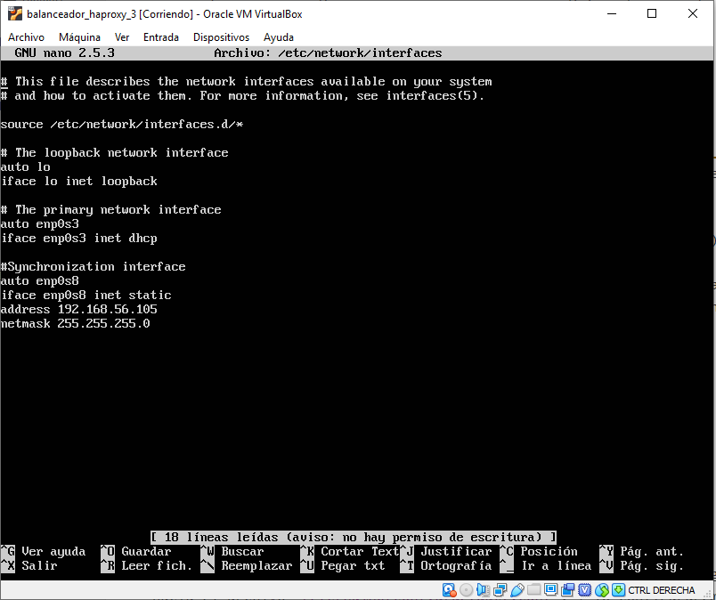
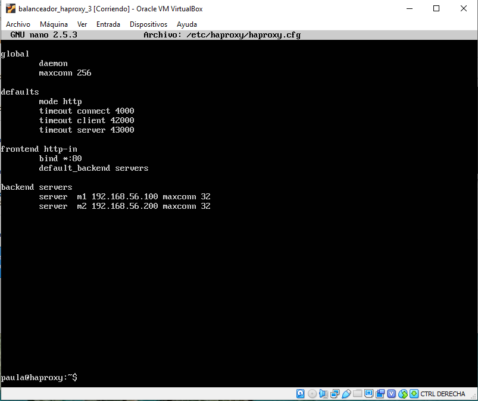

## Practica 3
### Balanceo de carga - por Paula Ruiz

Para empezar a configurar los balanceadores de carga, lo primero que he hecho ha sido ha sido crear dos maquinas virtuales, sin ningun tipo de paquete preinstalado (ya que no se debe ocupar el puerto 80).

Ha ambas maquinas les he asignado la IP 192.168.56.105.

### _nginx_ como balanceador de carga.
En este caso nuestra maquina virtual se llama __balanceador_nginx_3__. Lo primero que hemos hecho ha sido configurar la maquina para que se vea con las demas.

A continuacion, una vez que todas nuestras maquinas pueden verse, vamos a configurar el servicio de balanceo. Lo primero de todo instalar nginx:

`sudo apt-get install nginx`

Y comprobamos que todo funciona bien de primeras:

`systemctl start nginx`

`systemctl status nginx`

Ahora empezamos a configurar el balanceador, de manera que nos dirigiremos hacia el archivo _/etc/nginx/conf.d/default.conf_. Y lo configuraremos de tal forma que balancee los servidores de nuestras maquinas 1 y 2.

`nano /etc/nginx/conf.d/default.conf`

Por ultimo, modificamos el archivo _/etc/nginx/nginx.conf_ para que solamente actue como balanceador. Para ello comentamos la siguiente linea:

Y ya estaria nuestro balanceador configurado, solo quedaria probarlo en nuestra 4º maquina (en mi caso la 3º de las normales), mediante al siguiente orden:

`curl 192.168.56.105`

### _haproxy_ como balanceador de carga.

Igual que en el caso anterior, ahora vamos a configurar el balanceador de carga creado en la maquina virtual __balanceador_haproxy_3__.

Ahora, instalamos el servicio de haproxy, igual que en nginx:

`sudo apt-get install haproxy`

Una vez instalado, nos vamos a la configuracion de haproxy, situada en el archivo _/etc/haproxy/haproxy.cfg_. El cual nos debe quedar de la siguiente forma:

`nano /etc/haproxy/haproxy.cfg`

Una vez configurado todo, decidimos lanzar el servicio mediante la siguiente orden:

`sudo /usr/sbin/haproxy -f /etc/haproxy/haproxy.cfg`

Pero, como podemos comprobar, nos dice que tenemos una serie de errores, los cuales tratan de que estamos usando directivas obsoletas.

Por lo que solucionamos los errores, y nos quedarian la siguiente configuracion:

Y vemos que ya no nos sale ningun error al lanzar el servicio.

Por lo que ya solo nos queda comprobar que todo funciona correctamente en nuestra 4º maquina.

`curl 192.168.56.105`

### someter a la granja web a una alta carga, generada con la herramienta Apache Benchmark.
