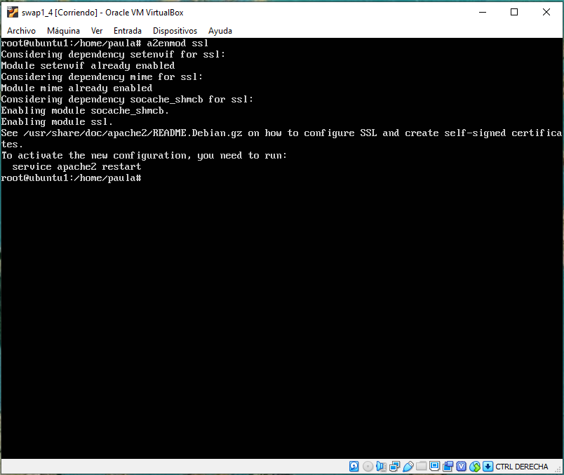
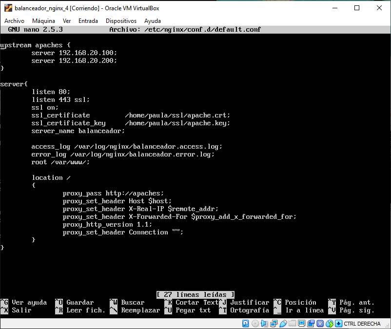
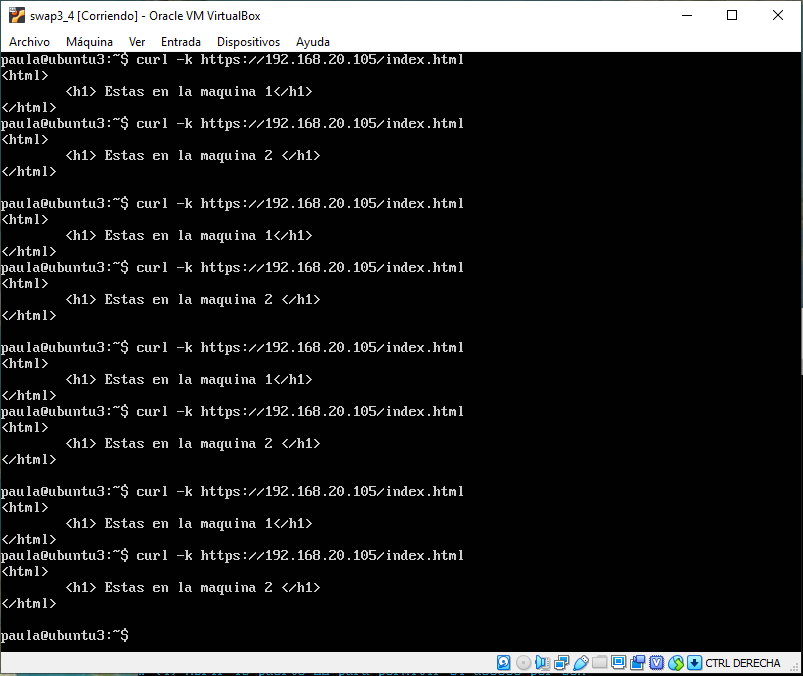
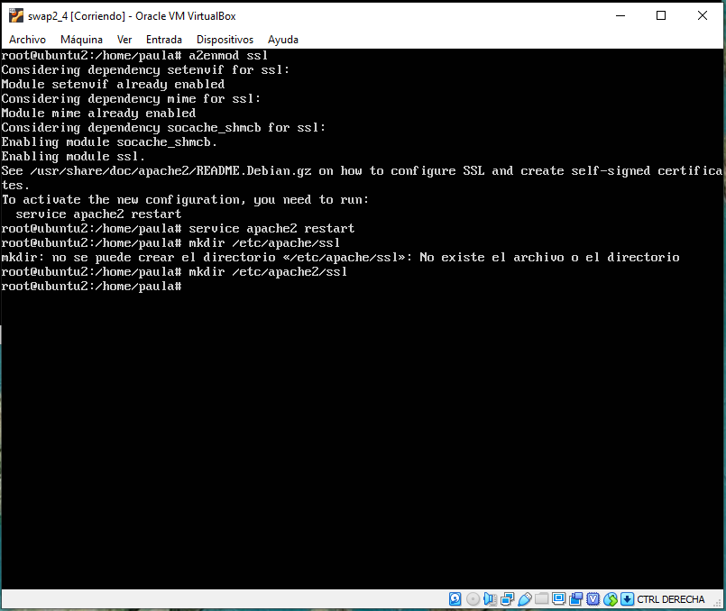
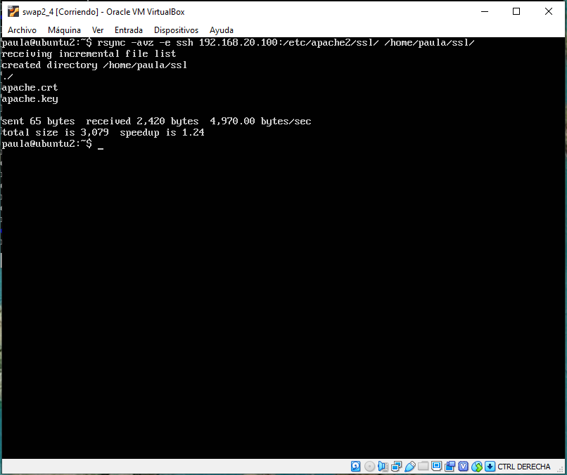
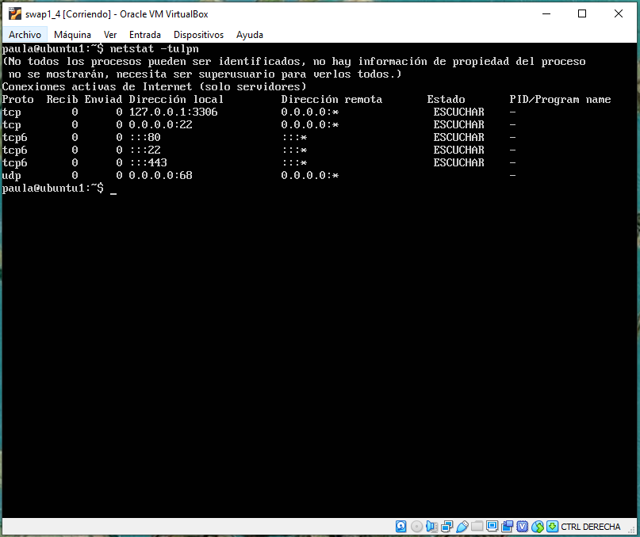
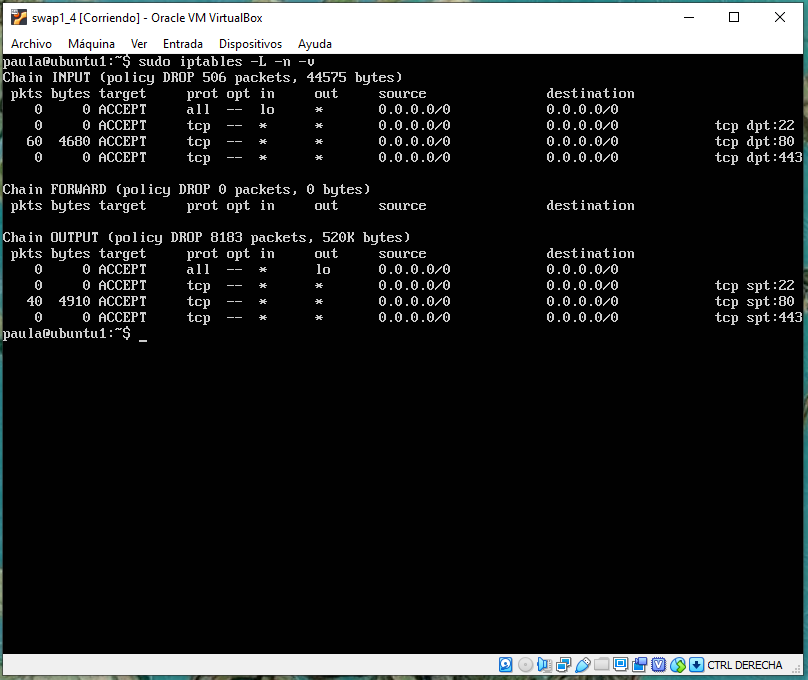

## Practica 4.
### Asegurar una granja web - por Paula Ruiz.

### Crear e instalar un certificado SSL autofirmado.
#### Primero instalamos en la Máquina 1

Lo primero que vamos a hacer en esta práctica es instalar un certificado SSL para brindar más seguridad al visitante de una página web. El protocolo SSL es un protocolo que se ubica en la pila de protocolos sobre TCP/IP, por lo que proporciona servicios de comunicación segura entre cliente y servidor.

Así que empezamos activando el module SSL de Apache con el comando `a2enmod ssl`.

Y a continuación activamos el servicio de apache y creamos el directorio donde vamos a crear las claves, y las creamos mediante OpenSSL.

`service apache2 restart
mkdir /etc/apache2/ssl
openssl req -x509 -nodes -days 365 -newkey rsa:2048 -keyout /etc/apache2/ssl/apache.key -out /etc/apache2/ssl/apache.crt`

A continuación editamos el archivo _/etc/apache2/sites-available/default-ssl.conf_ añadiendo las siguientes líneas:

`SSLCertificateFile /etc/apache2/ssl/apache.crt
SSLCertificateKeyFile /etc/apache2/ssl/apache.key`

Por último, activamos el sitio default-ssl y reiniciamos Apache.

`a2ensite default-ssl
service apache2 reload`

Y ya solo queda que comprobemos que esto funciona:

#### Y después lo copiamos a la Máquina 2 y al balanceador mediante Rsync

Ahora vamos a copiar las claves del certificado al balanceador y a la máquina 2 mediante el comando:

`rsync -avz -e ssh 192.168.20.100:/etc/apache2/ssl/ /home/paula/ssl/`

Primero lo pasamos al home de cada máquina, y a continuación en la máquina 2 lo movemos a su propia carpeta en _/etc/apache2/ssl_, mientras que en el balanceador podemos dejarlo en el mismo home.

A continuación una breve trayectoria de las configuraciones en ambos servidores.

__En el balanceador:__

Una vez tenemos la copia de las claves para el certificado, nos dirigimos al directorio _/etc/nginx/conf.d/default.conf_ y lo modificamos para que pueda escuchar también el _https_ desde el puerto _443_.

Y comprobamos que todo funciona mediante la orden:

`curl -k https://192.168.20.105/index.html`

__En la máquina 2:__

Una vez que lo tenemos aquí, hacemos los mismos pasos que hemos hecho antes para la máquina 1, excepto lo de crear el certificado.

Activamos el sitio y reiniciamos apache

Y por último comprobamos que todo funciona:

###Configurar cortafuego con IPTABLES.

Para configurar el cortafuegos, lo primero que creamos es un script con la configuración básica para un cortafuegos en Ubuntu, lo llamare _script_iptables.sh_ y lo ubicare en la carpeta _/usr/local/bin/_.

A continuación, vamos a hacer que se ejecute cada vez que se inicie la máquina. Para ello crearemos un demonio y lo ubicaremos en la carpeta _/etc/systemd/system/_ y lo llamaremos _config-iptables.service_.

Una vez creado, mediante los siguientes comandos, lo activamos.

`systemctl daemon-reload
systemctl enable config-iptables.service`

Y ya por último mediante `netstat -tulpn` y `iptables -L -n -v` comprobamos que todo funciona bien.

